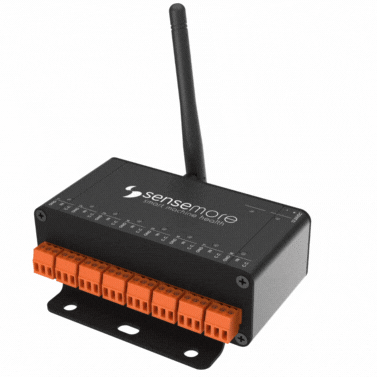

<h1>Sensemore DUCK </h1>



<h2>Introduction</h2>

Sensemore DUCK is a compact IoT data
acquisition hardware to collect process
data not only vibration, temperature, and
pressure but also whole analog data such
as; mass flow rate, speed, current, etc. You
can use the sensors with configurable
sampling frequencies according to your
needs.
Send the collected data to the cloud via
Wi-Fi. Monitor all metrics of data on
Sensemore Platform: LAKE. Find the root
causes of your machinery anomalies either
manually or by using predictive analytic
tools.

Measure real-time data at less sampling frequency for digital twin applications. Synchronously collected data are correlated with your models and monitored online. After data acquisition, Sensemore Platform LAKE offers ready advanced  signal processing tools to detect early- stage machinery failures required by expert analysts or plant operators.


## Accessing Web Configuration Page

Shortly after the Senseway is plugged in, it opens a wifi acces point network with **Senseway-CA&colon;B8&colon;XX&colon;XX&colon;XX&colon;XX** SSID'. Use default password to connect AP network, Open your browser and navigate to adress [http:\\\\192.168.4.1 ](http:\192.168.4.1)

## MQTT Broker and Certificates

Senseway needs MQTT / TLS configuration. The MQTT Broker Server to be used must support TLS and have the required certificates for the senseway.

-   MQTT endpoint (_mqtts: //my-mqtt-broker.server: 8883_)
-   CA (CA certificate)
-   Client Cert (a created and signed certificate from CA)
-   Client Key (private key of the certificate generated through the CA)

Required certificates and endpoint information are defined in 'Advance> MQTT' via the Senseway configuration page. Senseway uses these certificates for the future MQTT connections.

Details
https://www.hivemq.com/blog/mqtt-security-fundamentals-tls-ssl/

## NTP

_Default: http://pool.ntp.org/_
Time information is also used in the measurement messages sent by Senseway. Time synchronization is needed for this. For OnPremise installations, the time server can be defined from `Advance > NTP`.


## Operations

It explains which topics to use when communicating with Senseway and how messages should be interpreted.

`Actor` sends `Payload` with `PayloadType` format to `Topic`

### Scan

Senseway periodically initiates a scan for connected devices. Scan results are published periodically on MQTT. (~ 1min)

<table>
<tr>
<th>Actor</th>
<th>Topic</th>
<th>Payload Type</th>
<th>Payload Schema</th>
<th>Example</th>
</tr>
<tr>
<td>
Senseway
</td>

<td><b>prod/gateway/&lt;DeviceMac&gt;/scanDevice</b></td>

<td>json</td>
<td>

```json
{
	"<DEVICE-MAC>": {
		"type": "<DEVICE_TYPE>",
		"rssi": "<RSSI>",
		"status": "<STATUS>"
	},
	"<DEVICE-MAC2>": {
		"type": "<DEVICE_TYPE>",
		"rssi": "<RSSI>",
		"status": "<STATUS>"
	}
}
```

</td>
<td>

```json
{
	"CA:B8:31:00:00:1A":{
	"type":"WIRED",
	"rssi":"-19",
	"status":"Ready"
	},
	{
	"CA:B8:31:00:00:20":{
	"type":"WIRED",
	"rssi":"-19",
	"status":"Measuring"
	},
}
```

</td>
</tr>
</table>

### Requesting Senseway Version

<table>
<tr>
<th>Actor</th>
<th>Topic</th>
<th>Payload Type</th>
<th>Payload Schema</th>
<th>Example</th>
</tr>
<tr>
<td>
User
</td>
<td>
<b> prod/gateway/&lt;DeviceMac&gt;/client/SENSEWAY/version</b>
</td>
<td>
text
</td>
<td>
<i>empty text</i>
</td>
<td>
<i></i>
</td>
</tr>
<tr>
	<td>
	Senseway
	</td>
	<td>
	<b> prod/gateway/&lt;DeviceMac&gt;/client/SENSEWAY/version/accepted</b>
	</td>
	<td>
	text
	</td>
	<td>
	<i>version text</i>
	</td>
	<td>
	1.1.0
	</td>
</tr>
</table>


## Measurement and Configuration

The measurement process starts with sending a configuration to the end device, then the measurement reading process begins. Measurement reading process is done with chunks. The subscriber user is required to interpret and parse the measurement reading packets in the correct order.


## Measurement

The measurement process starts with sending a configuration to the end device, then the measurement reading process begins. Measurement reading process is done with chunks. The subscriber user is required to interpret and parse the measurement reading packets in the correct order.

### Measurement Configuration

<table>
<tr>
<th>
Parameters
</th>
<th>
Valid values
</th>
<th>
Explanation
</th>
</tr>
<tr>
<td>
samplingCoefficient
</td>
<td>
1(reserved, must use only 1)
</td>
<td>
1
</td>
</tr>
<tr>
<td>
baseSamplingFrequency
</td>
<td>
800,1600,3200,6400,12800,25600
</td>
<td>
~800Hz<br>~1600Hz<br>~3200Hz<br>~6400Hz<br>~12800Hz <br> ~25600Hz
</td>
</tr>
<tr>
<td>
sampleSize
</td>
<td>
100 - 1,000,000 
</td>
<td>

</td>
</tr>
<tr>
<tr>
<td>
external
</td>
<td>
true,false
</td>
<td>
Indicates using external voltage source
</td>
</tr>
<tr>
<td>
channels
</td>
<td>
[0,1,2,3,4,5,6,7]
</td>
<td>
Indicates which channels are enabled
</td>
</tr>
<tr>
<td>
objectId
</td>
<td>
https://docs.mongodb.com/manual/reference/method/ObjectId/</td>
<td>
measurement identier
</td>
</tr>
</table>

<table>

### Topics

</table>

<table>
<tr>
<th>Actor</th>
<th>Topic</th>
<th>Payload Type</th>
<th>Payload Schema</th>
<th>Example</th>
</tr>
<tr>
<td>
User
</td>
<td>
<b> prod/gateway/&lt;SensewayID&gt;/device/&lt;DeviceMac&gt;/measure/&lt;objectId&gt;</b>
</td>
<td>
text
</td>

<td>

```JSON
{
	"samplingCoefficient": 1,
	"baseSamplingFrequency": 6400,
	"external": false,
	"sampleSize": 1000,
	"channels": [1,2,3]
}
```
</td>
</tr>
<tr>
	<td>
	Senseway
	</td>
	<td>
	<b>   prod/gateway/&lt;SensewayID&gt;/device/&lt;DeviceMac&gt;/measure/&lt;objectId&gt;/accepted</b>
	</td>
	<td>
	text
	</td>
	<td>
	<i>empty text</i>
	</td>
	<td>
	</td>
</tr>
<tr>
	<td>
	Senseway
	</td>
	<td>
	<b> prod/gateway/&lt;SensewayID&gt;/device/&lt;DeviceMac&gt;/measure/&lt;objectId&gt;/rejected</b>
	</td>
	<td>
	text
	</td>
	<td>
	<i>error message</i>
	</td>
	<td>
	NO_DEVICE
	</td>
</tr>
<tr>
	<td>
	Senseway
	</td>
	<td>
	<b> prod/device/&lt;DeviceMac&gt;/measure/&lt;objectId&gt;/chunk/&lt;chunkIndex&gt;</b>
	</td>
	<td>
	binary
	</td>
	<td>
	<i>Binary chunk message</i>
	</td>
	<td>
	a0 43 46 04 b7 fc f1 43 03 04 b1 fc 94 43 04 04
	</td>
</tr>
<tr>
<td>
Senseway
</td>
<td>
<b> prod/gateway/&lt;SensewayID&gt;/device/&lt;DeviceMac&gt;/measure/&lt;objectId&gt;/done</b>
</td>
<td>
json
</td>
<td>

```json
{
	"STAT": {
		"MEASUREMENT_START_TIME": "<Hour: Minute: Second: Day: Month: Year>",
		"CALIBRATED_SAMPLINGRATE": "<calibratedSamplingRate>",
		"CHUNK_COUNT":10
	},
}
```

</td>
<td>

```json
{
	"STAT": {
		"MEASUREMENT_START_TIME": "12:36:10:22:00:2021",
		"CALIBRATED_SAMPLINGRATE": 6400,
		"CHUNK_COUNT":10
	},
	
}
```

</td>
</tr>
</table>

### Chunk ordering and interpretation

The measurements are divided into chunks and sent binary, chunkIndex is an index that counts down to 0. For example, we wanted a measurement of 10000 samples. We would see the following messages on MQTT.

> prod/gateway/CA&colon;B8&colon;28&colon;00&colon;00&colon;08/device/CA&colon;B8&colon;31&colon;00&colon;00&colon;1A/measure/098765432109876543214321 <br>
> {
    "samplingCoefficient": 1,
    "baseSamplingFrequency": 6400,
    "external": false,
    "sampleSize": 1000,
    "channels": [1,2,3]
}

> prod/gateway/CA&colon;B8&colon;28&colon;00&colon;00&colon;08/device/CA&colon;B8&colon;31&colon;00&colon;00&colon;1A/measure/098765432109876543214321/accepted<br>

> prod/device/CA&colon;B8&colon;31&colon;00&colon;00&colon;1A/measure/098765432109876543214321/chunk/2<br>
> a0 43 46 04 b7 fc f1 43 03 04 b1 fc 94 43 04 04

> prod/device/CA&colon;B8&colon;31&colon;00&colon;00&colon;1A/measure/098765432109876543214321/chunk/1<br>
> 21 04 99 fc f0 43 35 04 d5 fc a2 43 41 04 c6 fc

> prod/device/CA&colon;B8&colon;31&colon;00&colon;00&colon;1A/measure/098765432109876543214321/chunk/0<br>
> b1 fc a8 43 60 04 a8 fc a9 43 2c 04 c3 fc b2 43

> prod/gateway/CA&colon;B8&colon;28&colon;00&colon;00&colon;08/device/CA&colon;B8&colon;31&colon;00&colon;00&colon;1A/measure/098765432109876543214321/done<br>

```json
{
	"STAT": {
		"MEASUREMENT_START_TIME": "12:36:10:22:00:2021",
		"CALIBRATED_SAMPLINGRATE": 6400,
		"CHUNK_COUNT":10
	},
}
```

### Post Processing

The signal data from the device is uploaded in the form of chunks. Once the chunks are combined, the raw data needs to be merged. Each sample is interpreted as an unsigned 32-bit value. The sample format is shown below.

<table>
<tr>
<td colspan=3 textalign="center">
32 bit
</td>
<tr>
<td>
Channel(4bit)
</td>
<td>
Sign(4bit)
</td>
<td>
Data(24bit)
</td>
</tr>
</table>

Channel:integer
Sign: Eğer 0'dan farklı ise negatif, 0 ise pozitif

#### Parsing Data

Each data should be parsed and normalized according to ADC min-max values.
Following example show data parsing for each data

```javsacript
//helper function
function adc_conversion_helper(x, in_min, in_max, vref) {
    let out_min = -2 * vref;
    let out_max = 2 * vref;
    if (x < in_min) x = in_min;
    if (x > in_max) x = in_max;
    return (x - in_min) * (out_max - out_min) / (in_max - in_min) + out_min;
}

const ADC_IN_MIN = -16777216;
const ADC_IN_MAX = 16777215;
let values = []
for(let i=0; i<data.length; i++){
	let x = data[i];
	let channel_id = ((x >> 28) & 0x0f);
	let isNegative = (((x >> 24) & 0x0f)) != 0;
	let adc_data = (x & 0xffffff);

	if (isNegative) {
		adc_data = adc_data + ADC_IN_MIN;
	}

	//convert adc data to voltage using voltage reference
	let voltageReference = isExternal ? 2.5 : 2.4; 

	adc_data = 4 * adc_conversion_helper(adc_data, ADC_IN_MIN, ADC_IN_MAX, voltageReference);
	
	values.push([channel_id,adc_data])
}

```


## Device Firmware Update(OTA)

Sensemore end node devices accept firmware update over http. In order to start firmware update on end-node device, valid binary link sent to firmware update topic.

<table>
<tr>
<th>Actor</th>
<th>Topic</th>
<th>Payload Type</th>
<th>Payload Schema</th>
<th>Example</th>
</tr>
<tr>
<td>
User
</td>

<td><b>lake/gateway/&lt;DeviceMac&gt;/device/&lt;DeviceMac&gt;/ota</b></td>
<td>string</td>
<td>
<i>http url</i>
</td>
<td>
http://ftp.mydomain.com/Wired1.0.10.gbl
</td>
</tr>
<tr>
<td>
Senseway
</td>

<td><b>lake/gateway/&lt;DeviceMac&gt;/device/&lt;DeviceMac&gt;/ota/accepted</b></td>
<td><i>empty</i></td>
<td><i>empty</i></td>
<td></td>
</tr>
<tr>
<td>
Senseway
</td>

<td><b>lake/gateway/&lt;DeviceMac&gt;/device/&lt;DeviceMac&gt;/ota/rejected</b></td>
<td><i>Error Code</i></td>
<td><i>NO_DEVICE</i></td>
<td></td>
</tr>
<tr>
<td>
Senseway
</td>
<td><b>lake/gateway/&lt;DeviceMac&gt;/device/&lt;DeviceMac&gt;/ota/done</b></td>
<td><i>empty</i></td>
<td><i>empty</i></td>
<td></td>
</tr>
</table>

> Caution: A binary url should be `http` not ~`https`~

Senseway downloads the binary from given url and start firmware update for particular device.

Firmware updates led sequence of wired end nodes shown in the <a href="#/wired?id=_1wired-device-statuses-and-led-indicator">Wired documentation.</a>

## TLS

Senseway devices implement TLS for a secure mqtt connection. If you manage your mqtt broker yourself, it is necessary to configure the broker's TLS and generate the required certificates.

### Mosquitto Configuration

Referance:
http://www.steves-internet-guide.com/mosquitto-tls/
https://mosquitto.org/man/mosquitto-conf-5.html

Example configuration of ` mosquitto.conf`

```
port 8883
cafile C:\mosquitto\certs\ca.crt
keyfile C:\mosquitto\certs\server.key
certfile C:\mosquitto\certs\server.crt
tls_version tlsv1.2
```

### Certificate Generation

Referance:
http://www.steves-internet-guide.com/creating-and-using-client-certificates-with-mqtt-and-mosquitto/
Requirement: `openssl`

#### CA Generation

ca.key: `openssl genrsa -des3 -out ca.key 2048`

ca.crt: `openssl req -new -x509 -days 1826 -key ca.key -out ca.crt`

#### Server Certificate Generation

server.key `openssl genrsa -out server.key 2048`

server.csr ` openssl req -new -out server.csr -key server.key`

> While generating a Certificate Signing Request (CSR), you should write the domain name of your broker server in the "common name" field in the form filled in. If your server does not have a domain name, you must type in the IP address directly.

Normally, for certificate generation, the CRS is sent to the CA and the CA signs the CRS and generates a valid certificate. In this example, we can generate the certificate because we are the CA.

server.crt `openssl x509 -req -in server.csr -CA ca.crt -CAkey ca.key -CAcreateserial -out server.crt -days 3600`

Now `ca.crt`,`server.crt` and `server.key` can be used to configure mosquitto service with TLS support.

#### Client Certificate Generation

client.key `openssl genrsa -out client.key 2048`

client.csr `openssl req -new -out client.csr -key client.key`

> While generating a Certificate Signing Request (CSR), you should write the domain name of your broker server in the "common name" field in the form filled in. If your server does not have a domain name, you must type in the IP address directly.

client.crt `openssl x509 -req -in client.csr -CA ca.crt -CAkey ca.key -CAcreateserial -out client.crt -days 360`

Now, MQTT clients (Senseway) can establish a secure connection to the mqtt server using `ca.crt`,` client.crt` and `client.key`.

## Tips

-   If you are using mosquitto as a broker, you can view detailed logs by launching the application in verbose mode to solve potential problems.

-   Configuration page or open the laptop to the desktop computer offers a more robust link.

-   If you can manage the Wifi network, defining a static ip for the senseway can prevent DHCP-related problems that may occur in the future. (Weak modems, device networking problems).

-   Storing measurement signal data in any database may cause various difficulties due to the data shape, it will be convenient to save directly in the file system.

-   You should check beforehand that your wifi network is healthy and that you have access to mqtt servers.

