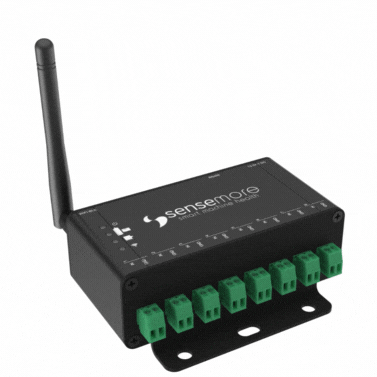

# <span style="color: rgb(240,95,34)">Senseway Integration Document</span>



Senseway is a gateway for Wired Pro, Infinity, Infinity Pro and Nomad sensors. Senseway handles networking, measurement scheduling, sleep, firmware update and more for Sensemore sensors.

Chekout Senseway data sheet _<http://sensemore.io/>_  
Chekout Senseway installation guide _<http://sensemore.io/>_

Before starting to speak about Senseway system integration, configure your Senseway's MQTT, NTP and HTTP settings.

### <span style="color: rgb(240,95,34)">Accessing Configuration Page</span>

Shortly after the Senseway is plugged in, it broadcats a Wi-Fi acces point network with **SENSEWAY-CA&colon;B8&colon;50&colon;XX&colon;XX&colon;XX** SSID'. Use default password to connect to the AP. Your device will launch configuration page in captive portal. If your device does not automatically launch captive portal, navigate to [http:\\\\192.168.4.1 ](http:\192.168.4.1) in your default browser.  
Once Senseway is connected to a network via Wi-Fi or Ethernet, its configuration page can be accessed through its local IP address from the same network. The local IP address is displayed on the home tab of the configuration page and is also shown in the MQTT information message.

## <span style="color: rgb(240,95,34)">Connectivity</span>

### <span style="color: rgb(240,95,34)">Wi-Fi & Ethernet</span>

Senseway supports both Wi-Fi and Ethernet for network connections. By default, the network adapter is set to Wi-Fi, but this can be modified in the Settings of the Configuration page `Settings > Connectivity`.

### <span style="color: rgb(240,95,34)">NTP</span>

Time information is also used in the measurement messages sent by Senseway. Time synchronization is needed for this. For OnPremise or private installations, default NTP server can be modified in Senseway Configuration page `Settings > NTP`.  
_Default: <http://pool.ntp.org/>_

### <span style="color: rgb(240,95,34)">MQTT</span>

Senseway needs MQTT / TLS configuration and supports variety of authentication mechanisms including: plaintext MQTT, MQTTs with and without password, and MQTTs with Client certificate.  
The MQTT Broker Server to be used must support TLS and provide the following for certificate-based connections:

- MQTT endpoint (_mqtts: //my-mqtt-broker.server: 8883_)
- CA (CA certificate)
- Client Cert (a created and signed certificate from CA)
- Client Key (private key of the certificate generated through the CA)

Required certificates and endpoint information are defined at `Settings > MQTT` in the Senseway configuration page. Senseway uses these certificates for the future MQTT connections.

Details
https://www.hivemq.com/blog/mqtt-security-fundamentals-tls-ssl/

### <span style="color: rgb(240,95,34)">HTTP</span>

HTTP here..

## <span style="color: rgb(240,95,34)">MQTT Integration</span>

This section explains which topics to use when communicating with Senseway over MQTT and how messages should be interpreted.

`Actor` sends `Payload` with `PayloadType` format to `Topic`

### <span style="color: rgb(240,95,34)">Information</span>

When Senseway powers on, it publishes a status message containing basic device information including **Firmware Version**. This status message can also be retrieved using the following topic:

<table>
<tr>
<th>Actor</th>
<th>Topic</th>
<th>Payload Type</th>
<th>Payload Schema</th>
<th>Example</th>
</tr>
<tr>
<td>
User
</td>
<td>
<b> sensemore/&lt;GatewayMac&gt;/info</b>
</td>
<td>
JSON
</td>
<td>
<i>Empty JSON</i>
</td>
<td>
<i></i>
</td>
</tr>
<tr>
<td>
Senseway
</td>

<td><b>sensemore/&lt;GatewayMac&gt;/info/accepted</b></td>

<td>JSON</td>
<td>

```json
{
  "Product": "Senseway",
  "Current Running Application": "SENSEWAY_VERSION>",
  "Version": "<FIRMWARE_VERSION>",
  "Compile Date": "<FIRMWARE_COMPILE_DATE>",
  "Compile Time": "<FIRMWARE_COMPILE_TIME>",
  "ESP-IDF Version": "<ESPRESSIF_IDF_VERSION>",
  "Network Mode": "<SELECTED_NETWORK_ADAPTOR>",
  "RSSI": <RECEIVED_SIGNAL_STRENTGH_INDICATOR>,
  "Local IP": "<ASSIGNED_LOCAL_IP>",
  "Network MAC": "<NETWORK_MAC_ADDRESS>",
  "Last Reset Reason": "<RESET_REASON>",
  "Runtime MS": <TIME_SINCE_LAST_RESET>,
  "Memory Info": {
    "Total Free Bytes": <STORAGE_CAPACITY>,
    "Total Allocated Bytes": <USABLE_STORAGE>,
    "Min Free Bytes": <MIN_FREE_BTYES>,
    "Largest Free Bytes": <LARGEST_FREE_BYTES>
  }
}
```

</td>
<td>

```json
{
  "Product": "Senseway",
  "Current Running Application": "SENSEWAY-3-0-0",
  "Version": "3.0.0",
  "Compile Date": "Jan 8 2018",
  "Compile Time": "12:00:00",
  "ESP-IDF Version": "v5.1.4",
  "Network Mode": "WIFI",
  "RSSI": -73,
  "Local IP": "192.168.1.111",
  "Network MAC": "00:00:00:00:00:00",
  "Last Reset Reason": "POWERON",
  "Runtime MS": 281440,
  "Memory Info": {
    "Total Free Bytes": 4034708,
    "Total Allocated Bytes": 403896,
    "Min Free Bytes": 4024696,
    "Largest Free Bytes": 3997696
  }
```

</td>
</tr>
</table>

### <span style="color: rgb(240,95,34)">Firmware Update Over the Air (OTA)</span>

Sensemore devices accept firmware update over HTTP. In order to start firmware update on the device, valid binary link sent to firmware update topic. Senseway downloads the binary from given url and start firmware update.

<table>
<tr>
<th>Actor</th>
<th>Topic</th>
<th>Payload Type</th>
<th>Payload Schema</th>
<th>Example</th>
</tr>
<tr>
<td>
User
</td>

<td><b>sensemore/&lt;GatewayMac&gt;/ota</b></td>
<td>JSON</td>
<td>
<i>http url</i>
</td>
<td>

```json
{
  "url": "http://link.mydomain.com/Senseway.bin"
}
```

</td>
</tr>
<tr>
<td>
Senseway
</td>

<td><b>sensemore/&lt;GatewayMac&gt;/ota/accepted</b></td>
<td><i>JSON</i></td>
<td><i>Status JSON</i></td>
<td>

```json
{
  "status": "OTA accepted"
}
```

</td>
</tr>
<tr>
<td>
Senseway
</td>

<td><b>sensemore/&lt;GatewayMac&gt;/ota/rejected</b></td>
<td><i>Text</i></td>
<td><i>Error Text</i></td>
<td>
Invalid payload! Url can't be null. Valid payload scheme: {
	"url":"http://link.mydomain.com/Senseway.bin"
}
</td>
</tr>
<tr>
<td>
Senseway
</td>
<td><b>sensemore/&lt;GatewayMac&gt;/restart</b></td>
<td><i>JSON</i></td>
<td><i>Status JSON</i></td>
<td>

```json
{
  "status": "Restarting device due to OTA"
}
```

</td>
</tr>
</table>

### <span style="color: rgb(240,95,34)">Restart</span>

Senseway can be restarted using the following topic.

<table>
<tr>
<th>Actor</th>
<th>Topic</th>
<th>Payload Type</th>
<th>Payload Schema</th>
<th>Example</th>
</tr>
<tr>
<td>
User
</td>
<td>
<b> sensemore/&lt;GatewayMac&gt;/restart</b>
</td>
<td>
JSON
</td>
<td>
<i>Empty JSON</i>
</td>
<td>
<i></i>
</td>
</tr>
</table>

### <span style="color: rgb(240,95,34)">Measurement Upload URL</span>

Senseway manages measurement uploads for attached devices by publishing metadata over MQTT and transmitting signal binaries via HTTP.  
The default binary upload URL is _<https://core.sensemore.io/measurement/>_,
however, the URL can be retrieved or modified using the following topic.

<table>
<tr>
<th>Actor</th>
<th>Topic</th>
<th>Payload Type</th>
<th>Payload Schema</th>
<th>Example</th>
</tr>
<tr>
<td>
User
</td>
<td>
<b> sensemore/&lt;GatewayMac&gt;/binaryurl/get</b>
</td>
<td>
JSON
</td>
<td>
<i>Empty JSON</i>
</td>
<td>
<i></i>
</td>
</tr>
<tr>
 <td>
 Senseway
 </td>
 <td>
 <b> sensemore/&lt;GatewayMac&gt;/binaryurl/get/accepted</b>
 </td>
 <td>
 JOSN
 </td>
 <td>
 <i>Binary URL JSON</i>
 </td>
 <td>

```json
{
  "binaryurl": "https://core.sensemore.io/measurement"
}
```

 </td>
</tr>
</table>

<table>
<tr>
<th>Actor</th>
<th>Topic</th>
<th>Payload Type</th>
<th>Payload Schema</th>
<th>Example</th>
</tr>
<tr>
<td>
User
</td>
<td>
<b> sensemore/&lt;GatewayMac&gt;/binaryurl/set</b>
</td>
<td>
JSON
</td>
<td>
<i>Binary URL JSON</i>
</td>
<td>
<i>

```json
{
  "binaryurl": "https://core.sensemore.io/measurement"
}
```

</i>
</td>
</tr>
<tr>
 <td>
 Senseway
 </td>
 <td>
 <b> sensemore/&lt;GatewayMac&gt;/binaryurl/set/accepted</b>
 </td>
 <td>
 JOSN
 </td>
 <td>
 <i>Status JSON</i>
 </td>
 <td>

```json
{
  "status": "Set Binary url accepted",
  "binaryurl": "https://core.sensemore.io/measurement"
}
```

 </td>
</tr>
</table>

### <span style="color: rgb(240,95,34)">Senseway - Wired Pro Communication Speed</span>

Senseway communicates with Wired Pro over RS485, which has a theoretical range of up to one kilometer.
This allows Senseway and Wired Pro to be placed up to 1 km apart and connected via an RS485 cable.
As the distance between them increases, the baudrate must be lowered to increase reliability.
Baudrate refers to the number of bits transmitted per second.
At shorter distances, increasing the baudrate can increase communication speed between Senseway and Wired Pro.
The baudrate can be viewed or modified via MQTT using the following topic.

:warning: When connecting multiple Wired Pros to the same Senseway, a bus topology must be used, ensuring no parallel lines are present.

<table>
<tr>
<th>Actor</th>
<th>Topic</th>
<th>Payload Type</th>
<th>Payload Schema</th>
<th>Example</th>
</tr>
<tr>
<td>
User
</td>
<td>
<b> sensemore/&lt;GatewayMac&gt;/baudrate/get</b>
</td>
<td>
JSON
</td>
<td>
<i>Empty JSON</i>
</td>
<td>
<i></i>
</td>
</tr>
<tr>
 <td>
 Senseway
 </td>
 <td>
 <b> sensemore/&lt;GatewayMac&gt;/baudrate/get/accepted</b>
 </td>
 <td>
 JOSN
 </td>
 <td>
 <i>Baudrate JSON</i>
 </td>
 <td>

```json
{
  "baudrate": 921600
}
```

 </td>
</tr>
</table>

**Valid badurate values:** 115200, 460800, 921600, 1000000

<table>
<tr>
<th>Actor</th>
<th>Topic</th>
<th>Payload Type</th>
<th>Payload Schema</th>
<th>Example</th>
</tr>
<tr>
<td>
User
</td>
<td>
<b> sensemore/&lt;GatewayMac&gt;/baudrate/set</b>
</td>
<td>
JSON
</td>
<td>
<i>Baudrate JSON</i>
</td>
<td>
<i>

```json
{
  "baudrate": 921600
}
```

</i>
</td>
</tr>
<tr>
 <td>
 Senseway
 </td>
 <td>
 <b> sensemore/&lt;GatewayMac&gt;/baudrate/set/accepted</b>
 </td>
 <td>
 JOSN
 </td>
 <td>
 <i>Status JSON</i>
 </td>
 <td>

```json
{
  "status": "Set baud rate accepted",
  "baudrate": 921600
}
```

 </td>
</tr>
</table>

### <span style="color: rgb(240,95,34)">Device List</span>

The list of devices attached to Senseway, along with their measurement configurations, can be retrieved using the following topic.

<table>
<tr>
<th>Actor</th>
<th>Topic</th>
<th>Payload Type</th>
<th>Payload Schema</th>
<th>Example</th>
</tr>
<tr>
<td>
User
</td>
<td>
<b> sensemore/&lt;GatewayMac&gt;/device-list/get</b>
</td>
<td>
JSON
</td>
<td>
<i>Empty JSON</i>
</td>
<td>
<i></i>
</td>
</tr>
<tr>
 <td>
 Senseway
 </td>
 <td>
 <b> sensemore/&lt;GatewayMac&gt;/device-list/get/accepted</b>
 </td>
 <td>
 JOSN
 </td>
 <td>
 <i>Scan JSON</i>
 </td>
 <td>

```json
{
  "devices": [
    {
      "mac": "CA:B8:41:XX:XX:XX",
      "device_config": {
        "rs485_resistor_enabled": false,
        "trigger_enabled": false,
        "accelerometer_range": 16,
        "sampling_rate": 25600,
        "sample_size": 50000,
        "sensor_type": 1,
        "scheduler_enabled": false
      }
    },
    {
      "mac": "CA:B8:30:XX:XX:XX",
      "device_config": {
        "rs485_resistor_enabled": false,
        "trigger_enabled": false,
        "accelerometer_range": 16,
        "sampling_rate": 25600,
        "sample_size": 50000,
        "sensor_type": 1,
        "scheduler_enabled": false
      }
    }
  ]
}
```

 </td>
</tr>
</table>

Senseway evaluates the connection status of each assigned sensor upon receiving a scan command. It then publishes a result message that includes the **Firmware Version** of each connected device.

:warning: Infinity, Infinity Pro and Nomad may appear as "not scanned" if they are on sleeping schedule.

<table>
<tr>
<th>Actor</th>
<th>Topic</th>
<th>Payload Type</th>
<th>Payload Schema</th>
<th>Example</th>
</tr>
<tr>
<td>
User
</td>
<td>
<b> sensemore/&lt;GatewayMac&gt;/devices/get</b>
</td>
<td>
JSON
</td>
<td>
<i>Empty JSON</i>
</td>
<td>
<i></i>
</td>
</tr>
<tr>
 <td>
 Senseway
 </td>
 <td>
 <b> sensemore/&lt;GatewayMac&gt;/devices/get/accepted</b>
 </td>
 <td>
 JOSN
 </td>
 <td>
 <i>Config JSON</i>
 </td>
 <td>

```json
{
  "devices": [
    {
      "mac": "CA:B8:41:XX:XX:XX",
      "status": "connected",
      "version": "2.1.14",
      "device_config": {
        "rs485_resistor_enabled": false,
        "trigger_enabled": false,
        "accelerometer_range": 16,
        "sampling_rate": 25600,
        "sample_size": 50000,
        "sensor_type": 1,
        "scheduler_enabled": false
      }
    },
    {
      "mac": "CA:B8:30:XX:XX:XX",
      "status": "scanned",
      "rssi": -58,
      "version": "3.0,0",
      "device_config": {
        "rs485_resistor_enabled": false,
        "trigger_enabled": false,
        "accelerometer_range": 16,
        "sampling_rate": 25600,
        "sample_size": 50000,
        "sensor_type": 1,
        "scheduler_enabled": false
      }
    }
  ]
}
```

 </td>
</tr>
</table>

### <span style="color: rgb(240,95,34)">Device Firmware Update Over The Air (OTA)</span>

Sensemore end node devices accept firmware update over HTTP. In order to start firmware update on end-node device, valid binary link sent to firmware update topic.
Senseway downloads the binary from given url and start firmware update for particular device.

<table>
<tr>
<th>Actor</th>
<th>Topic</th>
<th>Payload Type</th>
<th>Payload Schema</th>
<th>Example</th>
</tr>
<tr>
<td>
User
</td>

<td><b>sensemore/&lt;GatewayMac&gt;/device/&lt;DeviceMac&gt;/ota</b></td>
<td>JSON</td>
<td>
<i>http url</i>
</td>
<td>

```json
{
  "url": "http://link.mydomain.com/Device.bin"
}
```

</td>
</tr>
<tr>
<td>
Senseway
</td>

<td><b>sensemore/&lt;GatewayMac&gt;/device/&lt;DeviceMac&gt;/ota/accepted</b></td>
<td><i>JSON</i></td>
<td><i>Status JSON</i></td>
<td>

```json
{
  "status": "OTA accepted"
}
```

</td>
</tr>
<tr>
<td>
Senseway
</td>

<td><b>sensemore/&lt;GatewayMac&gt;/device/&lt;DeviceMac&gt;/ota/rejected</b></td>
<td><i>Text</i></td>
<td><i>Error Text</i></td>
<td>
Invalid payload! Url can't be null. Valid payload scheme: {
	"url":"http://example.com"
}
</td>
</tr>
<tr>
<td>
Senseway
</td>
<td><b>sensemore/&lt;GatewayMac&gt;/device/&lt;DeviceMac&gt;/ota/done</b></td>
<td><i>JSON</i></td>
<td><i>Status JSON</i></td>
<td></td>
</tr>
</table>

### <span style="color: rgb(240,95,34)">Device Add & Remove</span>

Senseway's sensor configuration can be viewed or modifyed over MQTT with the following topics.

<table>
<tr>
<th>Actor</th>
<th>Topic</th>
<th>Payload Type</th>
<th>Payload Schema</th>
<th>Example</th>
</tr>
<tr>
<td>
User
</td>
<td>
<b> sensemore/&lt;GatewayMac&gt;/device/add</b>
</td>
<td>
JSON
</td>
<td>
<i>Mac JSON</i>
</td>
<td>
<i>

```json
{
  "mac": "CA:B8:XX:XX:XX:XX"
}
```

</i>
</td>
</tr>
<tr>
 <td>
 Senseway
 </td>
 <td>
 <b> sensemore/&lt;GatewayMac&gt;/device/add/accepted</b>
 </td>
 <td>
 JOSN
 </td>
 <td>
 <i>Status JSON</i>
 </td>
 <td>

```json
{
  "status": "Device added"
}
```

 </td>
</tr>
</table>

<table>
<tr>
<th>Actor</th>
<th>Topic</th>
<th>Payload Type</th>
<th>Payload Schema</th>
<th>Example</th>
</tr>
<tr>
<td>
User
</td>
<td>
<b> sensemore/&lt;GatewayMac&gt;/device/remove</b>
</td>
<td>
JSON
</td>
<td>
<i>Mac JSON</i>
</td>
<td>
<i>

```json
{
  "mac": "CA:B8:XX:XX:XX:XX"
}
```

</i>
</td>
</tr>
<tr>
 <td>
 Senseway
 </td>
 <td>
 <b> sensemore/&lt;GatewayMac&gt;/device/remove/accepted</b>
 </td>
 <td>
 JOSN
 </td>
 <td>
 <i>Status JSON</i>
 </td>
 <td>

```json
{
  "status": "Device removed"
}
```

 </td>
</tr>
</table>

### <span style="color: rgb(240,95,34)">Device Measurement Configuration</span>

Senseway is compatible with both wired sensors (Wired Pro) and wireless sensors (Infinity, Infinity Pro, Nomad). Wireless sensors typically utilize a sleep schedule feature to extend their battery life, allowing for operation of up to 2 years on a single charge.

<table>
<tr>
<th>Device Config</th>
<th>Explaniation</th>
</tr>
<tr>
<td>

```json
{
  "device_mac": "CA:B8:XX:XX:XX:XX",
  "device_config": {
    "rs485_resistor_enabled": false,
    "accelerometer_range": 16,
    "sampling_rate": 25600,
    "sample_size": 50000,
    "sensor_type": 1,
    "scheduler_enabled": false,
    "trigger_enabled": false
  }
}
```

</td>
<td>

```json

{
  "device_mac": "Device ID",
  "device_config": {
    "rs485_resistor_enabled": Termination resistor, only applicable to Wired Pro,
    "accelerometer_range": 16,
    "sampling_rate": 25600,
    "sample_size": 50000,
    "sensor_type": [1 for accelerometer, 0 for unkown devices],
    "scheduler_enabled": Periodic measurement & sleep schedule for Infinity family devices,
    "trigger_enabled": Senseway tigger number for a perticular device
  }
}
```

</td>
<td>
</tr>
</table>
:warning: When multiple Wired Pros are connected to the same Senseway, 
only the termination resistor of the Wired Pro farthest from the Senseway should be enabled. 
Enabling termination resistors on multiple Wired Pros connected to the same Senseway may permanently damage your devices.

The configuration of a specific device can be retrieved using the following topic.

<table>
<tr>
<th>Actor</th>
<th>Topic</th>
<th>Payload Type</th>
<th>Payload Schema</th>
<th>Example</th>
</tr>
<tr>
<td>
User
</td>
<td>
<b> sensemore/&lt;GatewayMac&gt;/device/&lt;DeviceMac&gt;/config/get</b>
</td>
<td>
JSON
</td>
<td>
<i>Empty JSON</i>
</td>
<td>
<i></i>
</td>
</tr>
<tr>
 <td>
 Senseway
 </td>
 <td>
 <b> sensemore/&lt;GatewayMac&gt;/device/&lt;DeviceMac&gt;/config/get/accepted</b>
 </td>
 <td>
 JOSN
 </td>
 <td>
 <i>Config JSON</i>
 </td>
 <td>

```json
{
  "device_mac": "CA:B8:XX:XX:XX:XX",
  "device_config": {
    "rs485_resistor_enabled": false,
    "accelerometer_range": 16,
    "sampling_rate": 25600,
    "sample_size": 50000,
    "sensor_type": 1,
    "scheduler_enabled": false,
    "trigger_enabled": false
  }
}
```

 </td>
</tr>
</table>

The configuration of a specific device can be modified using the following topic.

<table>
<tr>
<th>Actor</th>
<th>Topic</th>
<th>Payload Type</th>
<th>Payload Schema</th>
<th>Example</th>
</tr>
<tr>
<td>
User
</td>
<td>
<b> sensemore/&lt;GatewayMac&gt;/device/&lt;DeviceMac&gt;/config/set</b>
</td>
<td>
JSON
</td>
<td>
<i>Config JSON</i>
</td>
<td>
<i>

```json
{
  "device_config": {
    "rs485_resistor_enabled": false,
    "accelerometer_range": 16,
    "sampling_rate": 25600,
    "sample_size": 50000,
    "sensor_type": 1,
    "scheduler_enabled": false,
    "scheduler_period": false,
    "trigger_enabled": false,
    "trigger_pin": false
  }
}
```

</i>
</td>
</tr>
<tr>
 <td>
 Senseway
 </td>
 <td>
 <b> sensemore/&lt;GatewayMac&gt;/device/&lt;DeviceMac&gt;/config/set/accepted</b>
 </td>
 <td>
 JOSN
 </td>
 <td>
 <i>Status JSON</i>
 </td>
 <td>

```json
{
  "device_config": {
    "rs485_resistor_enabled": false,
    "accelerometer_range": 16,
    "sampling_rate": 25600,
    "sample_size": 50000,
    "sensor_type": 1,
    "scheduler_enabled": false,
    "scheduler_period": false,
    "trigger_enabled": false,
    "trigger_pin": false
  },
  "status": "Device config updated",
  "mac": "End Node Mac"
}
```

 </td>
</tr>
</table>

### <span style="color: rgb(240,95,34)">Measurement</span>

Senseway initiates automatic measurement using the scheduling feature. It also accepts manual measurements from the Sensemore Lake platform as well as  MQTT based on the configurations set previously. MQTT measurement topics are as follows.

<table>
<tr>
<th>Actor</th>
<th>Topic</th>
<th>Payload Type</th>
<th>Payload Schema</th>
<th>Example</th>
</tr>
<tr>
<td>
User
</td>
<td>
<b> sensemore/&lt;GatewayMac&gt;/device/&lt;DeviceMac&gt;/measure/&lt;MeasuremnetUUID&gt;</b>
</td>
<td>
JSON
</td>
<td>
<i>Empty JSON</i>
</td>
<td>
<i></i>
</td>
</tr>
<tr>
 <td>
 Senseway
 </td>
 <td>
 <b> sensemore/&lt;GatewayMac&gt;/device/&lt;DeviceMac&gt;/measure/&lt;MeasuremnetUUID&gt;/accepted</b>
 </td>
 <td>
 JOSN
 </td>
 <td>
 <i>Status JSON</i>
 </td>
 <td>

```json
{
  "status": "Measurement started"
}
```

 </td>
</tr>
</tr>
<tr>
 <td>
 Senseway
 </td>
 <td>
 <b> sensemore/&lt;GatewayMac&gt;/device/&lt;DeviceMac&gt;/measure/&lt;MeasuremnetUUID&gt;/done</b>
 </td>
 <td>
 JOSN
 </td>
 <td>
 <i>Status JSON</i>
 </td>
 <td>

```json
{
  "status": "Measurement done"
}
```

 </td>
</tr>
</tr>
<tr>
 <td>
 Senseway
 </td>
 <td>
 <b> sensemore/&lt;GatewayMac&gt;/device/&lt;DeviceMac&gt;/measure/&lt;MeasuremnetUUID&gt;/metadatas</b>
 </td>
 <td>
 JOSN
 </td>
 <td>
 <i>Metadata JSON</i>
 </td>
 <td>

```json
{
  "unixtimestamp": 1734443808,
  "calibrated_sampling_rate": 26746,
  "temperature": 22.719999313354492,
  "battery_voltage": 4.0489997863769531,
  "sampling_rate": 25600,
  "sample_size": 50000,
  "accelerometer_range": 16,
  "measurement_type": 1,
  "measurement_buffer_size": 300000
}
```

 </td>
</tr>
</table>

## <span style="color: rgb(240,95,34)">HTTP Integration</span>

### <span style="color: rgb(240,95,34)">Login</span>

<table>
<tr>
<th>Method</th>
<th>Endpoint</th>
<th>Body</th>
<th>Example</th>
</tr>
<tr>
<td>
POST
</td>
<td>
<b> /login</b>
</td>
<td>
JSON
</td>
<td>
<i>

```json
{
  "password": "<DEFAULT_PASSWORD>"
}
```

</i>
</td>
</tr>
<tr>
 <td>
 GET
 </td>
 <td>
 <b> /login</b>
 </td>
 <td>
 JOSN
 </td>
 <td>
 <i>

```json
{
  "token": "CLjziyTeTzlMsv100mvgkxnTQl1nGYXpQvsIStAW16WrMjxzLvhNTOGhcFFzU38mT8sHKFhxBOm3309qxSmzKIHJux3rUbjVTkywmayA1O05hKaQn9jlY99YMmp1NorF"
}
```

 </i>
 </td>
</tr>
</table>

### <span style="color: rgb(240,95,34)">Information</span>

<table>
<tr>
<th>Method</th>
<th>Endpoint</th>
<th>Body</th>
<th>Example</th>
</tr>
<tr>
<td>
GET
</td>
<td>
<b> /info</b>
</td>
<td>
JSON
</td>
<td>
<i>

```json
{
  "mac_address": "CA:B8:50:XX:XX:XX",
  "version": "3.1.9",
  "is_network_connected": true,
  "is_internet_connected": true
}
```

</i>
</td>
</tr>
</table>

### <span style="color: rgb(240,95,34)">Firmware Update Over the Air (OTA)</span>

otaa

### <span style="color: rgb(240,95,34)">Restart</span>

<table>
<tr>
<th>Method</th>
<th>Endpoint</th>
<th>Body</th>
<th>Example</th>
</tr>
<tr>
<td>
GET
</td>
<td>
<b> /restart</b>
</td>
<td>
JSON
</td>
<td>
<i>
</i>
</td>
</tr>
</table>

### <span style="color: rgb(240,95,34)">Measurement Upload URL</span>

<table>
<tr>
<th>Method</th>
<th>Endpoint</th>
<th>Body</th>
<th>Example</th>
</tr>
<tr>
<td>
GET
</td>
<td>
<b> /binary-url</b>
</td>
<td>
JSON
</td>
<td>
<i>

```json
{
  "url": "https://core.sensemore.io/measurement"
}
```

</i>
</td>
</tr>
<tr>
 <td>
 POST
 </td>
 <td>
 <b>/binary-url</b>
 </td>
 <td>
 JOSN
 </td>
 <td>
 <i>

```json
{
  "url": "https://core.sensemore.io/measurement"
}
```

 </i>
 </td>
</tr>
</table>

### <span style="color: rgb(240,95,34)">Senseway - Wired Pro Communication Speed</span>

<table>
<tr>
<th>Method</th>
<th>Endpoint</th>
<th>Body</th>
<th>Example</th>
</tr>
<tr>
<td>
GET
</td>
<td>
<b> /baudrate</b>
</td>
<td>
JSON
</td>
<td>
<i>

```json
{
  "baudrate": 921600
}
```

</i>
</td>
</tr>
<tr>
 <td>
 POST
 </td>
 <td>
 <b> /baudrate</b>
 </td>
 <td>
 JOSN
 </td>
 <td>
 <i>

```json
{
  "baudrate": 921600
}
```

 </i>
 </td>
</tr>
</table>

### <span style="color: rgb(240,95,34)">Device List</span>

<table>
<tr>
<th>Method</th>
<th>Endpoint</th>
<th>Body</th>
<th>Example</th>
</tr>
<tr>
<td>
GET
</td>
<td>
<b> /device-count</b>
</td>
<td>
JSON
</td>
<td>
<i>

```json
{
  "count": 2
}
```

</i>
</td>
</tr>
</table>

<table>
<tr>
<th>Method</th>
<th>Endpoint</th>
<th>Body</th>
<th>Example</th>
</tr>
<tr>
<td>
GET
</td>
<td>
<b> /device-list</b>
</td>
<td>
JSON
</td>
<td>
<i>

```json
{
  "devices": [
    {
      "mac": "CA:B8:41:XX:XX:XX",
      "device_config": {
        "rs485_resistor_enabled": false,
        "trigger_enabled": false,
        "accelerometer_range": 16,
        "sampling_rate": 25600,
        "sample_size": 50000,
        "sensor_type": 1,
        "scheduler_enabled": false
      }
    },
    {
      "mac": "CA:B8:30:XX:XX:XX",
      "device_config": {
        "rs485_resistor_enabled": false,
        "trigger_enabled": false,
        "accelerometer_range": 16,
        "sampling_rate": 25600,
        "sample_size": 50000,
        "sensor_type": 1,
        "scheduler_enabled": false
      }
    }
  ]
}
```

</i>
</td>
</tr>
</table>

<table>
<tr>
<th>Method</th>
<th>Endpoint</th>
<th>Body</th>
<th>Example</th>
</tr>
<tr>
<td>
GET
</td>
<td>
<b> /devices</b>
</td>
<td>
JSON
</td>
<td>
<i>

```json
{
  "devices": [
    {
      "mac": "CA:B8:41:XX:XX:XX",
      "status": "connected",
      "version": "2.1.14",
      "device_config": {
        "rs485_resistor_enabled": false,
        "trigger_enabled": false,
        "accelerometer_range": 16,
        "sampling_rate": 25600,
        "sample_size": 50000,
        "sensor_type": 1,
        "scheduler_enabled": false
      }
    },
    {
      "mac": "CA:B8:30:XX:XX:XX",
      "status": "scanned",
      "rssi": -58,
      "version": "3.0,0",
      "device_config": {
        "rs485_resistor_enabled": false,
        "trigger_enabled": false,
        "accelerometer_range": 16,
        "sampling_rate": 25600,
        "sample_size": 50000,
        "sensor_type": 1,
        "scheduler_enabled": false
      }
    }
  ]
}
```

</i>
</td>
</tr>
</table>

### <span style="color: rgb(240,95,34)">Device Firmware Update Over The Air (OTA)</span>

### <span style="color: rgb(240,95,34)">Device Add & Remove</span>

<table>
<tr>
<th>Method</th>
<th>Endpoint</th>
<th>Body</th>
<th>Example</th>
</tr>
<tr>
<td>
POST
</td>
<td>
<b> /device-add</b>
</td>
<td>
JSON
</td>
<td>
<i>

```json
{
  "mac": "CA:B8:XX:XX:XX:XX"
}
```

</i>
</td>
</tr>
</table>

<table>
<tr>
<th>Method</th>
<th>Endpoint</th>
<th>Body</th>
<th>Example</th>
</tr>
<tr>
<td>
POST
</td>
<td>
<b> /device-remove</b>
</td>
<td>
JSON
</td>
<td>
<i>

```json
{
  "mac": "CA:B8:XX:XX:XX:XX"
}
```

</i>
</td>
</tr>
</table>

### <span style="color: rgb(240,95,34)">Device Measurement Configuration</span>

<table>
<tr>
<th>Method</th>
<th>Endpoint</th>
<th>Body</th>
<th>Example</th>
</tr>
<tr>
<td>
GET
</td>
<td>
<b> /device-config</b>
</td>
<td>
JSON
</td>
<td>
<i>

```json
{}
```

</i>
</td>
</tr>
<tr>
 <td>
 POST
 </td>
 <td>
 <b> /device-config</b>
 </td>
 <td>
 JOSN
 </td>
 <td>
 <i>

```json
{}
```

 </i>
 </td>
</tr>
</table>

### <span style="color: rgb(240,95,34)">Measurement</span>
