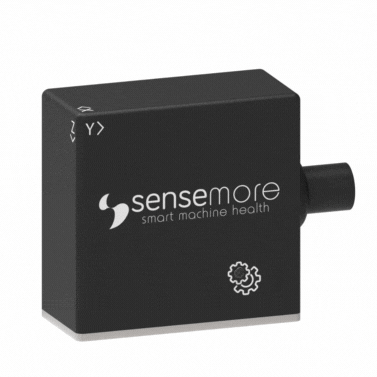

# <span style="color: rgb(240,95,34)">Wired Pro Integration Documentation</span>

### <span style="color: rgb(240,95,34)">Wired Pro Operational Modes</span>

❗️ Wired Pro is a versatile IoT data acquisition device with two distinct operational modes:
**1. RS485 mode:**
In this mode, Wired Pro connects to Senseway (or a third party gateway) over an RS485 cable. It is controlled by the gateway and operates as a 3-axis accelerometer and temperature sensor. The wire protocol is documented in the [RS485 Integration](#rs485-integration) section below. For the Senseway gateway itself, refer to the [Senseway Integration Documentation](senseway_system_integration.md).
**2. Wi-Fi mode:**
In Wi-Fi mode, Wired Pro functions as its own gateway, managing its sensors independently. Sections [MQTT Integration](#mqtt-integration) and [HTTP Integration](#http-integration) describe this mode.



Wired Pro is a combined gateway and sensor array capable of capturing 3-axis acceleration and temperature readings. It can process measurements, apply measurement strategies, and upload data to the cloud. Powered by a 5-24V DC input, Wired Pro operates without the need for charging.

Before starting to speak about Wired Pro system integration, configure your Wired Pro's MQTT, NTP and HTTP settings.

### <span style="color: rgb(240,95,34)">Accessing Configuration Page</span>

Shortly after the Wired Pro is plugged in, it broadcasts a Wi-Fi access point network with the **WiredPro-CA&colon;B8&colon;41&colon;XX&colon;XX&colon;XX** SSID. Use the default password to connect to the AP. Your device will launch the configuration page in a captive portal. If your device does not automatically launch the captive portal, navigate to [http://192.168.4.1](http://192.168.4.1) in your default browser.
Once Wired Pro is connected to a network via Wi-Fi, its configuration page can be accessed through its local IP address from the same network. The local IP address is displayed on the home tab of the configuration page and is also shown in the MQTT information message.

## <span style="color: rgb(240,95,34)">Connectivity</span>

### <span style="color: rgb(240,95,34)">Wi-Fi</span>

Wired Pro supports Wi-Fi for wireless network connections.

### <span style="color: rgb(240,95,34)">NTP</span>

Time information is used in the measurement messages sent by Wired Pro, so time synchronization is required. For OnPremise or private installations, the default NTP server can be modified from the Wired Pro configuration page under `Settings > NTP`, or over the [`/sntp`](#-ntp) endpoint.

❗️ The value is an **NTP server hostname**, not a URL. Do not prefix it with a
scheme and do not append a path — `pool.ntp.org` is valid, `http://pool.ntp.org/` is not
and will prevent the device from synchronizing its clock.

_Default: `pool.ntp.org`_

### <span style="color: rgb(240,95,34)">MQTT</span>

Wired Pro needs MQTT / TLS configuration and supports a variety of authentication mechanisms including: plaintext MQTT, MQTTs with and without password, and MQTTs with client certificate.The MQTT broker server to be used must support TLS and provide the following for certificate-based connections:

- MQTT endpoint (_mqtts: //my-mqtt-broker.server: 8883_)
- CA (CA certificate)
- Client Cert (a created and signed certificate from CA)
- Client Key (private key of the certificate generated through the CA)

Required certificates and endpoint information are defined at `Settings > MQTT` in the Wired Pro configuration page. Wired Pro uses these certificates for future MQTT connections.

Details
https://www.hivemq.com/blog/mqtt-security-fundamentals-tls-ssl/

### <span style="color: rgb(240,95,34)">HTTP</span>

Wired Pro can be controlled over HTTP, allowing for configuration modifications and measurement actions. Accessing HTTP endpoints requires an initial login, after which the received token must be used for subsequent communications. Detailed information is available in the [HTTP Integration](#http-integration) section.

### <span style="color: rgb(240,95,34)">RS485</span>

In RS485 mode Wired Pro acts as a slave on a half-duplex RS485 bus and speaks the EasyCom
frame protocol. See [RS485 Integration](#rs485-integration).

## <span style="color: rgb(240,95,34)">Measurement Strategy</span>

❗️ **Changed in 3.1.x.** Earlier firmware exposed a fixed-period scheduler
(`scheduler_period`). That field no longer exists. Wired Pro now runs a **smart measurement**
strategy: it continuously monitors a lightweight RMS value and triggers a full measurement
only when the vibration level actually changes, with a guaranteed heartbeat so data never
stops flowing.

A full measurement is triggered when **any** of the following holds:

1. It is the first evaluation after boot or after a configuration change.
2. `now - last_trigger >= hearthbeat_interval_seconds` — the heartbeat.
3. Both change thresholds are exceeded **and** the minimum interval has elapsed:
   - `|rms - previous_rms| >= absolute_change`, **and**
   - `|rms - previous_rms| / previous_rms >= relative_change`, **and**
   - `now - last_trigger >= min_trigger_interval_seconds`

Requiring both an absolute and a relative threshold avoids re-triggering on sensor noise
while the machine is idle, and keeps the device responsive when vibration ramps up.

### Configuration fields

These fields are shared by the [`/configuration`](#-http-measurement-configuration) HTTP endpoint and the
[`device/<mac>/config/set`](#mqtt-measurement-configuration) MQTT topic.

| Field                            | Type     | Valid values                                                | Default   | Description                                  |
| -------------------------------- | -------- | ----------------------------------------------------------- | --------- | -------------------------------------------- |
| `accelerometer_range`          | number   | `2`, `4`, `8`, `16`                                 | `16`    | Full-scale range in g                        |
| `sampling_rate`                | number   | `800`, `1600`, `3200`, `6400`, `12800`, `25600` | `25600` | Hz                                           |
| `sample_size`                  | number   | `100` – `120000`                                       | `50000` | Samples per axis                             |
| `scheduler_enabled`            | see note | `0`/`1` over HTTP, `true`/`false` over MQTT         | `0`     | Enables smart measurement                    |
| `hearthbeat_interval_seconds`  | number   | `>= 900`                                                  | `1800`  | Guaranteed measurement interval              |
| `min_trigger_interval_seconds` | number   | `>= 60` and `<= hearthbeat_interval_seconds`            | `300`   | Rate limit for change-triggered measurements |
| `relative_change`              | number   | `>= 0`                                                    | `0.10`  | Ratio, e.g.`0.10` = 10%                    |
| `absolute_change`              | number   | `>= 0`                                                    | `0.05`  | Absolute change in g                         |

❗️ Two things to watch for:

- **`hearthbeat_interval_seconds` is spelled exactly as shown** (with the `th`). This is the
  wire key; the misspelling is preserved for backward compatibility.
- **`scheduler_enabled` has a different type per transport**: it must be a JSON **number**
  (`0`/`1`) over HTTP and a JSON **boolean** (`true`/`false`) over MQTT. Sending the wrong
  type is rejected.

All eight fields are **required** on every write. A request missing any one of them, or
violating any range constraint above, is rejected — HTTP returns `400`, MQTT publishes to the
corresponding `.../rejected` topic with the offending field name in the status message.

## <span style="color: rgb(240,95,34)">MQTT Integration</span>

This section explains which topics to use when communicating with Wired Pro over MQTT and how messages should be interpreted.

`Actor` sends `Payload` with `PayloadType` format to `Topic`

### <span style="color: rgb(240,95,34)">Information</span>

When Wired Pro powers on, it publishes a status message containing basic device information including **Firmware Version**. This status message can also be retrieved using the following topic:

<table>
<tr>
<th>Actor</th>
<th>Topic</th>
<th>Payload Type</th>
<th>Payload Schema</th>
<th>Example</th>
</tr>
<tr>
<td>
User
</td>
<td>
<b> sensemore/&lt;GatewayMac&gt;/info</b>
</td>
<td>
JSON
</td>
<td>
<i>Empty JSON</i>
</td>
<td>
<i></i>
</td>
</tr>
<tr>
<td>
Wired Pro
</td>
<td><b>sensemore/&lt;GatewayMac&gt;/info/accepted</b></td>
<td>JSON</td>
<td>

```json
{
  "Product": "WIREDPRO",
  "Current Running Application": "<WIREDPRO_APPLICATION_NAME>",
  "Version": "<FIRMWARE_VERSION>",
  "Compile Date": "<FIRMWARE_COMPILE_DATE>",
  "Compile Time": "<FIRMWARE_COMPILE_TIME>",
  "ESP-IDF Version": "<ESPRESSIF_IDF_VERSION>",
  "RSSI": <RECEIVED_SIGNAL_STRENGTH_INDICATOR>,
  "Local IP": "<ASSIGNED_LOCAL_IP>",
  "Network MAC": "<NETWORK_MAC_ADDRESS>",
  "Last Reset Reason": "<RESET_REASON>",
  "Runtime MS": <TIME_SINCE_LAST_RESET>,
  "Memory Info": {
    "Total Free Bytes": <TOTAL_FREE_HEAP_BYTES>,
    "Total Allocated Bytes": <TOTAL_ALLOCATED_HEAP_BYTES>,
    "Min Free Bytes": <MIN_FREE_HEAP_BYTES>,
    "Largest Free Bytes": <LARGEST_FREE_HEAP_BLOCK_BYTES>
  }
}
```

</td>
<td>

```json
{
  "Product": "WIREDPRO",
  "Current Running Application": "WiredPro-3-1-2",
  "Version": "3.1.2",
  "Compile Date": "Jan 8 2018",
  "Compile Time": "12:00:00",
  "ESP-IDF Version": "v5.1.4",
  "RSSI": -60,
  "Local IP": "192.168.1.161",
  "Network MAC": "00:00:00:00:00:00",
  "Last Reset Reason": "POWERON",
  "Runtime MS": 1231660,
  "Memory Info": {
    "Total Free Bytes": 66576,
    "Total Allocated Bytes": 198868,
    "Min Free Bytes": 60216,
    "Largest Free Bytes": 40960
  }
}
```

</td>
</tr>
</table>

❗️ `Memory Info` reports **heap** statistics, not storage capacity.

### <span style="color: rgb(240,95,34)">Firmware Update Over the Air (OTA)</span>

Sensemore devices accept firmware updates over HTTP. To start a firmware update on the device, send a valid binary link to the firmware update topic. Wired Pro downloads the binary from the given URL and starts the firmware update.

❗️ The URL **must be plain `http://`**. `https://` URLs are rejected — the TLS
stack is reserved for the MQTT connection and the measurement upload. Host the update binary
on a plaintext HTTP endpoint reachable from the device.

<table>
<tr>
<th>Actor</th>
<th>Topic</th>
<th>Payload Type</th>
<th>Payload Schema</th>
<th>Example</th>
</tr>
<tr>
<td>
User
</td>
<td><b>sensemore/&lt;GatewayMac&gt;/ota</b></td>
<td>JSON</td>
<td>
<i>http url</i>
</td>
<td>

```json
{
  "url": "http://link.mydomain.com/WiredPro.bin"
}
```

</td>
</tr>
<tr>
<td>
Wired Pro
</td>
<td><b>sensemore/&lt;GatewayMac&gt;/ota/accepted</b></td>
<td>JSON</td>
<td><i>Status JSON</i></td>
<td>

```json
{
  "status": "OTA accepted"
}
```

</td>
</tr>
<tr>
<td>
Wired Pro
</td>
<td><b>sensemore/&lt;GatewayMac&gt;/ota/rejected</b></td>
<td>JSON</td>
<td><i>Status JSON</i></td>
<td>

```json
{
  "status": "'url' is not exists or invalid!"
}
```

</td>
</tr>
<tr>
<td>
Wired Pro
</td>
<td><b>sensemore/&lt;GatewayMac&gt;/ota/done</b></td>
<td>JSON</td>
<td><i>Status JSON</i></td>
<td>

```json
{
  "status": "Restarting device due to OTA"
}
```

</td>
</tr>
</table>

### <span style="color: rgb(240,95,34)">Restart</span>

Wired Pro can be restarted using the following topic.

<table>
<tr>
<th>Actor</th>
<th>Topic</th>
<th>Payload Type</th>
<th>Payload Schema</th>
<th>Example</th>
</tr>
<tr>
<td>
User
</td>
<td>
<b> sensemore/&lt;GatewayMac&gt;/restart</b>
</td>
<td>
JSON
</td>
<td>
<i>Empty JSON</i>
</td>
<td>
<i></i>
</td>
</tr>
</table>

❗️ This is a subscribe-only topic. The device does not publish a confirmation —
it simply reboots and republishes its `info/accepted` message on reconnect.

### <span style="color: rgb(240,95,34)">Device Configuration</span>

Wired Pro's measurement strategy and configuration can be retrieved using the following topic.

<table>
<tr>
<th>Actor</th>
<th>Topic</th>
<th>Payload Type</th>
<th>Payload Schema</th>
<th>Example</th>
</tr>
<tr>
<td>
User
</td>
<td>
<b> sensemore/&lt;GatewayMac&gt;/devices/get</b>
</td>
<td>
JSON
</td>
<td>
<i>Empty JSON</i>
</td>
<td>
<i></i>
</td>
</tr>
<tr>
 <td>
 Wired Pro
 </td>
 <td>
 <b> sensemore/&lt;GatewayMac&gt;/devices/get/accepted</b>
 </td>
 <td>
 JSON
 </td>
 <td>
 <i>Device Config JSON</i>
 </td>
 <td>

```json
{
  "devices": [
    {
      "mac": "CA:B8:41:XX:XX:XX",
      "status": "connected",
      "version": "3.1.2",
      "device_config": {
        "accelerometer_range": 16,
        "sampling_rate": 25600,
        "sample_size": 50000,
        "scheduler_enabled": true,
        "hearthbeat_interval_seconds": 1800,
        "min_trigger_interval_seconds": 300,
        "relative_change": 0.1,
        "absolute_change": 0.05
      }
    }
  ]
}
```

 </td>
</tr>
</table>

### <span style="color: rgb(240,95,34)">MQTT Measurement Configuration</span>

Wired Pro's measurement configuration can be viewed or modified over MQTT with the following topics. Field semantics and constraints are documented in [Measurement Strategy](#measurement-strategy).

<table>
<tr>
<th>Actor</th>
<th>Topic</th>
<th>Payload Type</th>
<th>Payload Schema</th>
<th>Example</th>
</tr>
<tr>
<td>
User
</td>
<td>
<b> sensemore/&lt;GatewayMac&gt;/device/&lt;GatewayMac&gt;/config/get</b>
</td>
<td>
JSON
</td>
<td>
<i>Empty JSON</i>
</td>
<td>
<i></i>
</td>
</tr>
<tr>
 <td>
 Wired Pro
 </td>
 <td>
 <b> sensemore/&lt;GatewayMac&gt;/device/&lt;GatewayMac&gt;/config/get/accepted</b>
 </td>
 <td>
 JSON
 </td>
 <td>
 <i>Config JSON</i>
 </td>
 <td>

```json
{
  "device_mac": "CA:B8:41:XX:XX:XX",
  "device_config": {
    "accelerometer_range": 16,
    "sampling_rate": 25600,
    "sample_size": 50000,
    "scheduler_enabled": true,
    "hearthbeat_interval_seconds": 1800,
    "min_trigger_interval_seconds": 300,
    "relative_change": 0.1,
    "absolute_change": 0.05
  }
}
```

 </td>
</tr>
</table>

<table>
<tr>
<th>Actor</th>
<th>Topic</th>
<th>Payload Type</th>
<th>Payload Schema</th>
<th>Example</th>
</tr>
<tr>
<td>
User
</td>
<td>
<b> sensemore/&lt;GatewayMac&gt;/device/&lt;GatewayMac&gt;/config/set</b>
</td>
<td>
JSON
</td>
<td>
<i>Config JSON — all eight fields required</i>
</td>
<td>
<i>

```json
{
  "device_mac": "CA:B8:41:XX:XX:XX",
  "device_config": {
    "accelerometer_range": 16,
    "sampling_rate": 25600,
    "sample_size": 50000,
    "scheduler_enabled": true,
    "hearthbeat_interval_seconds": 1800,
    "min_trigger_interval_seconds": 300,
    "relative_change": 0.1,
    "absolute_change": 0.05
  }
}
```

</i>
</td>
</tr>
<tr>
 <td>
 Wired Pro
 </td>
 <td>
 <b> sensemore/&lt;GatewayMac&gt;/device/&lt;GatewayMac&gt;/config/set/accepted</b>
 </td>
 <td>
 JSON
 </td>
 <td>
 <i>Status JSON</i>
 </td>
 <td>

```json
{
  "device_mac": "CA:B8:41:XX:XX:XX",
  "device_config": {
    "accelerometer_range": 16,
    "sampling_rate": 25600,
    "sample_size": 50000,
    "scheduler_enabled": true,
    "hearthbeat_interval_seconds": 1800,
    "min_trigger_interval_seconds": 300,
    "relative_change": 0.1,
    "absolute_change": 0.05
  },
  "status": "Device config updated"
}
```

 </td>
</tr>
<tr>
 <td>
 Wired Pro
 </td>
 <td>
 <b> sensemore/&lt;GatewayMac&gt;/device/&lt;GatewayMac&gt;/config/set/rejected</b>
 </td>
 <td>
 JSON
 </td>
 <td>
 <i>Status JSON</i>
 </td>
 <td>

```json
{
  "status": "Invalid payload! 'hearthbeat_interval_seconds' is missing or invalid"
}
```

 </td>
</tr>
</table>

❗️ `scheduler_enabled` must be a JSON **boolean** on this transport.

### <span style="color: rgb(240,95,34)">Measurement</span>

Wired Pro initiates automatic measurements using the [smart measurement strategy](#measurement-strategy). It also accepts manual measurements from the Sensemore Lake platform, over MQTT, and over [HTTP](#-http-measurement), based on the configuration set previously. MQTT measurement topics are as follows.

<table>
<tr>
<th>Actor</th>
<th>Topic</th>
<th>Payload Type</th>
<th>Payload Schema</th>
<th>Example</th>
</tr>
<tr>
<td>
User
</td>
<td><b>sensemore/&lt;GatewayMac&gt;/device/&lt;GatewayMac&gt;/measure/&lt;MEASUREMENT_UUID&gt;</b></td>
<td>JSON</td>
<td>
<i>Empty JSON</i>
</td>
<td>
</td>
</tr>
<tr>
<td>
Wired Pro
</td>
<td><b>sensemore/&lt;GatewayMac&gt;/device/&lt;GatewayMac&gt;/measure/&lt;MEASUREMENT_UUID&gt;/accepted</b></td>
<td><i>JSON</i></td>
<td><i>Status JSON</i></td>
<td>

```json
{
  "status": "success"
}
```

</td>
</tr>
<tr>
<td>
Wired Pro
</td>
<td><b>sensemore/&lt;GatewayMac&gt;/device/&lt;GatewayMac&gt;/measure/&lt;MEASUREMENT_UUID&gt;/metadatas</b></td>
<td><i>JSON</i></td>
<td><i>Metadata JSON</i></td>
<td>

```json
{
  "unixtimestamp": 1734617027,
  "sum_x": -3250.361328125,
  "sum_y": 1844.42333984375,
  "sum_z": -7643.8251953125,
  "mean_x": -0.39005896173346932,
  "mean_y": 0.2213396543674247,
  "mean_z": -0.91729571526611065,
  "peak_x": 0.038008180483469323,
  "peak_y": 0.0423322206325753,
  "peak_z": 0.039735534733889355,
  "peak_to_peak_x": 0.07373046875,
  "peak_to_peak_y": 0.0791015625,
  "peak_to_peak_z": 0.07080078125,
  "clearance_x": 164.31150332922692,
  "clearance_y": 193.61163139253921,
  "clearance_z": 195.9534386192756,
  "crest_x": 7.6797359331360573,
  "crest_y": 8.9543432043988656,
  "crest_z": 9.27409693825784,
  "vrms_x": 0.017510145845642453,
  "vrms_y": 0.050003347640017633,
  "vrms_z": 0.01880110921075584,
  "grms_x": 0.0049491520039737225,
  "grms_y": 0.00472756288945675,
  "grms_z": 0.0042845718562603,
  "kurtosis_x": 17.458915614260821,
  "kurtosis_y": 18.276360133218649,
  "kurtosis_z": 17.757537090857209,
  "skewness_x": 0.65933222563406724,
  "skewness_y": 1.4794854818975853,
  "skewness_z": -1.0167293724548387,
  "temperature": 41.1187515258789,
  "calibrated_sampling_rate": 26513,
  "sampling_rate": 25600,
  "sample_size": 50000,
  "accelerometer_range": 16,
  "measurement_buffer_size": 300000
}
```

</td>
</tr>
<tr>
<td>
Wired Pro
</td>
<td><b>sensemore/&lt;GatewayMac&gt;/device/&lt;GatewayMac&gt;/measure/&lt;MEASUREMENT_UUID&gt;/done</b></td>
<td><i>JSON</i></td>
<td><i>Status JSON</i></td>
<td>

```json
{
  "status": "Measurement done"
}
```

</td>
</tr>
</table>

Units: `grms_*`, `peak_*`, `peak_to_peak_*`, `mean_*` are in **g**; `vrms_*` is in **mm/s**;
`temperature` is in **°C**. `calibrated_sampling_rate` is the measured actual ODR of the
accelerometer and is what should be used when interpreting the raw signal — it differs from
the requested `sampling_rate` by the sensor's internal frequency trim.

Measurement UUIDs generated by the device itself use the prefixes `WR-SMRT-` (smart
measurement) and `WR-TRIG-` ([HTTP trigger](#-trigger-measurement)).

## <span style="color: rgb(240,95,34)">HTTP Integration</span>

Wired Pro offers HTTP endpoints for retrieving or modifying settings on Wired Pro.

Some endpoints require an authentication token in the header. Endpoints requiring an authentication token in the header are marked with the 🔐 symbol.
This token is obtained using the Login endpoint, as shown below.

### <span style="color: rgb(240,95,34)">Login</span>

<table>
<tr>
<th>Method</th>
<th>Endpoint</th>
<th>Content-Type</th>
<th>Request</th>
<th>Response</th>
</tr>
<tr>
<td>
POST
</td>
<td>
<b> /login</b>
</td>
<td>
application/json
</td>
<td>
<i>

```json
{
  "password": "<DEVICE_PASSWORD>"
}
```

</i>
</td>
<td>
<i>

```json
{
  "token": "CLjziyTeTzlMsv100mvgkxnTQl1nGYXpQvsIStAW16WrMjxzLvhNTOGhcFFzU38mT8sHKFhxBOm3309qxSmzKIHJux3rUbjVTkywmayA1O05hKaQn9jlY99YMmp1NorF"
}
```

</i>
</td>
</tr>
</table>

❗️ The token is returned in the **response body of `POST /login`**. There is no
`GET /login` endpoint. Only one token is valid at a time — logging in again invalidates the
previous token, as do `/logout` and `/change_password`.

#### <span style="color: rgb(240,95,34)">Include your token in the Header</span>

Once the authentication token is obtained via the Login endpoint, it must be included in the header of each HTTP request for 🔐 endpoints, as shown below.

```
Authorization: CLjziyTeTzlMsv100mvgkxnTQl1nGYXpQvsIStAW16WrMjxzLvhNTOGhcFFzU38mT8sHKFhxBOm3309qxSmzKIHJux3rUbjVTkywmayA1O05hKaQn9jlY99YMmp1NorF
```

### <span style="color: rgb(240,95,34)">🔐 Logout</span>

Invalidates the current token.

<table>
<tr>
<th>Method</th>
<th>Endpoint</th>
<th>Content-Type</th>
<th>Example</th>
</tr>
<tr>
<td>
POST
</td>
<td>
<b> /logout</b>
</td>
<td>
application/json
</td>
<td>
<i>No body</i>
</td>
</tr>
</table>

### <span style="color: rgb(240,95,34)">Information</span>

Basic information about the device, including its **Firmware Version**, can be retrieved using the following HTTP endpoint. This is the only endpoint that does not require a token.

<table>
<tr>
<th>Method</th>
<th>Endpoint</th>
<th>Content-Type</th>
<th>Example</th>
</tr>
<tr>
<td>
GET
</td>
<td>
<b> /info</b>
</td>
<td>
application/json
</td>
<td>
<i>

```json
{
  "mac_address": "CA:B8:41:XX:XX:XX",
  "version": "3.1.2",
  "is_network_connected": true,
  "is_internet_connected": true
}
```

</i>
</td>
</tr>
</table>

### <span style="color: rgb(240,95,34)">🔐 Change Password</span>

The device's HTTP and web configuration interface password can be changed using the following HTTP endpoint. On success the current token is invalidated and a new login is required.

<table>
<tr>
<th>Method</th>
<th>Endpoint</th>
<th>Content-Type</th>
<th>Example</th>
</tr>
<tr>
<td>
PUT
</td>
<td>
<b> /change_password</b>
</td>
<td>
application/json
</td>
<td>
<i>

Request:

```json
{
  "old_password": "<CURRENT_PASSWORD>",
  "new_password": "12345678"
}
```

Response:

```json
{
  "success": true
}
```

</i>
</td>
</tr>
</table>

### <span style="color: rgb(240,95,34)">🔐 NTP</span>

Time information is part of the measurement messages sent by Wired Pro. NTP configuration can be retrieved or modified using the following HTTP endpoint.

<table>
<tr>
<th>Method</th>
<th>Endpoint</th>
<th>Content-Type</th>
<th>Example</th>
</tr>
<tr>
<td>
GET
</td>
<td>
<b> /sntp</b>
</td>
<td>
application/json
</td>
<td>
<i>

```json
{
  "sntp_server": "pool.ntp.org"
}
```

</i>
</td>
</tr>
<tr>
 <td>
 POST
 </td>
 <td>
 <b>/sntp</b>
 </td>
 <td>
 application/json
 </td>
 <td>
 <i>

Request:

```json
{
  "sntp_server": "pool.ntp.org"
}
```

Response:

```json
{
  "success": true
}
```

 </i>
 </td>
</tr>
</table>

❗️ Hostname only — see the [NTP](#ntp) note above.

### <span style="color: rgb(240,95,34)">🔐 Firmware Update Over the Air (OTA)</span>

Uploads a firmware binary directly to the device. The request body is the raw `.bin` file.
The device reboots roughly 3 seconds after responding.

<table>
<tr>
<th>Method</th>
<th>Endpoint</th>
<th>Content-Type</th>
<th>Example</th>
</tr>
<tr>
<td>
POST
</td>
<td>
<b> /ota</b>
</td>
<td>
application/octet-stream
</td>
<td>
<i>Raw firmware binary. Responds <code>{"success": true}</code>. If no chunk arrives within
10 seconds the transfer is aborted with <code>408</code>.</i>
</td>
</tr>
</table>

### <span style="color: rgb(240,95,34)">🔐 Restart</span>

Wired Pro can be restarted using the following endpoint.

<table>
<tr>
<th>Method</th>
<th>Endpoint</th>
<th>Content-Type</th>
<th>Example</th>
</tr>
<tr>
<td>
POST
</td>
<td>
<b> /restart</b>
</td>
<td>
application/json
</td>
<td>
<i>No body. The device reboots immediately, so the connection is closed without a response body.</i>
</td>
</tr>
</table>

❗️ This endpoint is **POST**, not GET.

### <span style="color: rgb(240,95,34)">🔐 Measurement Upload URL</span>

Wired Pro manages measurement uploads itself by publishing metadata over MQTT and transmitting signal binaries via HTTPS.
The default binary upload URL is _[https://core.sensemore.io/measurement](https://core.sensemore.io/measurement)_, and it can be retrieved or modified using the following endpoint.

<table>
<tr>
<th>Method</th>
<th>Endpoint</th>
<th>Content-Type</th>
<th>Example</th>
</tr>
<tr>
<td>
GET
</td>
<td>
<b> /binary-url</b>
</td>
<td>
application/json
</td>
<td>
<i>

```json
{
  "url": "https://core.sensemore.io/measurement"
}
```

</i>
</td>
</tr>
<tr>
 <td>
 POST
 </td>
 <td>
 <b>/binary-url</b>
 </td>
 <td>
 application/json
 </td>
 <td>
 <i>

Request:

```json
{
  "url": "https://core.sensemore.io/measurement"
}
```

Response:

```json
{
  "success": true
}
```

 </i>
 </td>
</tr>
</table>

### <span style="color: rgb(240,95,34)">🔐 HTTP Measurement Configuration</span>

Wired Pro's measurement configuration can be viewed or modified with the following endpoint. Field semantics and constraints are documented in [Measurement Strategy](#measurement-strategy).

<table>
<tr>
<th>Method</th>
<th>Endpoint</th>
<th>Content-Type</th>
<th>Example</th>
</tr>
<tr>
<td>
GET
</td>
<td>
<b> /configuration</b>
</td>
<td>
application/json
</td>
<td>
<i>

```json
{
  "accelerometer_range": 16,
  "sampling_rate": 25600,
  "sample_size": 50000,
  "scheduler_enabled": 1,
  "hearthbeat_interval_seconds": 1800,
  "min_trigger_interval_seconds": 300,
  "relative_change": 0.1,
  "absolute_change": 0.05
}
```

</i>
</td>
</tr>
<tr>
 <td>
 POST
 </td>
 <td>
 <b>/configuration</b>
 </td>
 <td>
 application/json
 </td>
 <td>
 <i>

Request — all eight fields are required:

```json
{
  "accelerometer_range": 16,
  "sampling_rate": 25600,
  "sample_size": 50000,
  "scheduler_enabled": 1,
  "hearthbeat_interval_seconds": 1800,
  "min_trigger_interval_seconds": 300,
  "relative_change": 0.1,
  "absolute_change": 0.05
}
```

Response:

```json
{
  "success": true
}
```

 </i>
 </td>
</tr>
</table>

❗️ `scheduler_enabled` must be a JSON **number** (`0`/`1`) on this transport.

### <span style="color: rgb(240,95,34)">🔐 HTTP Measurement</span>

Takes a single measurement using the currently saved configuration and returns its metadata
in the response body. This is a **local** operation: it does not publish to MQTT and does not
upload the raw signal binary. Use [`/trigger-measurement`](#-trigger-measurement) for a full
cloud round-trip.

The request blocks until the measurement completes, which at `sample_size` 50000 and
`sampling_rate` 25600 takes several seconds. Size your client timeout accordingly.

<table>
<tr>
<th>Method</th>
<th>Endpoint</th>
<th>Content-Type</th>
<th>Request</th>
<th>Response</th>
</tr>
<tr>
<td>
POST
</td>
<td>
<b> /measure</b>
</td>
<td>
application/json
</td>
<td>
<i>No body required. Send an empty JSON object <code>{}</code>.</i>
</td>
<td>
<i>

The measurement metadata, in the same shape as the MQTT `metadatas` payload:

```json
{
  "unixtimestamp": 1734617027,
  "sum_x": -3250.361328125,
  "sum_y": 1844.42333984375,
  "sum_z": -7643.8251953125,
  "mean_x": -0.39005896173346932,
  "mean_y": 0.2213396543674247,
  "mean_z": -0.91729571526611065,
  "peak_x": 0.038008180483469323,
  "peak_y": 0.0423322206325753,
  "peak_z": 0.039735534733889355,
  "peak_to_peak_x": 0.07373046875,
  "peak_to_peak_y": 0.0791015625,
  "peak_to_peak_z": 0.07080078125,
  "clearance_x": 164.31150332922692,
  "clearance_y": 193.61163139253921,
  "clearance_z": 195.9534386192756,
  "crest_x": 7.6797359331360573,
  "crest_y": 8.9543432043988656,
  "crest_z": 9.27409693825784,
  "vrms_x": 0.017510145845642453,
  "vrms_y": 0.050003347640017633,
  "vrms_z": 0.01880110921075584,
  "grms_x": 0.0049491520039737225,
  "grms_y": 0.00472756288945675,
  "grms_z": 0.0042845718562603,
  "kurtosis_x": 17.458915614260821,
  "kurtosis_y": 18.276360133218649,
  "kurtosis_z": 17.757537090857209,
  "skewness_x": 0.65933222563406724,
  "skewness_y": 1.4794854818975853,
  "skewness_z": -1.0167293724548387,
  "temperature": 41.1187515258789,
  "calibrated_sampling_rate": 26513,
  "sampling_rate": 25600,
  "sample_size": 50000,
  "accelerometer_range": 16,
  "measurement_buffer_size": 300000
}
```

</i>
</td>
</tr>
</table>

### <span style="color: rgb(240,95,34)">🔐 Trigger Measurement</span>

Takes an immediate measurement and performs the **full upload pipeline** — publishes
`accepted`, `metadatas` and `done` on the MQTT measurement topics and uploads the raw signal
binary to the configured [binary URL](#-measurement-upload-url) — exactly as a scheduled
smart measurement would.

❗️ **This endpoint disables smart measurement as a side effect.** It sets
`scheduler_enabled` to false (preserving the other four smart-measurement parameters) before
taking the measurement, so periodic measurements stop until you re-enable them via
[`/configuration`](#-http-measurement-configuration) or the
[`config/set`](#mqtt-measurement-configuration) MQTT topic.

The device generates the measurement UUID itself, using the form `WR-TRIG-<14 random chars>`.
Subscribe to `sensemore/<GatewayMac>/device/<GatewayMac>/measure/+/#` to observe the result.

The request blocks for the duration of the measurement **and** the binary upload — expect
tens of seconds at large sample sizes over a slow link.

<table>
<tr>
<th>Method</th>
<th>Endpoint</th>
<th>Content-Type</th>
<th>Request</th>
<th>Response</th>
</tr>
<tr>
<td>
POST
</td>
<td>
<b> /trigger-measurement</b>
</td>
<td>
application/json
</td>
<td>
<i>No body required. Send an empty JSON object <code>{}</code>.</i>
</td>
<td>
<i>

```json
{
  "success": true
}
```

On failure the device responds with `500` and an error object:

```json
{
  "success": false,
  "error": "Failed to trigger measurement and upload"
}
```

</i>
</td>
</tr>
</table>

## <span style="color: rgb(240,95,34)">RS485 Integration</span>

In RS485 mode Wired Pro is a **slave** on a half-duplex RS485 bus and never initiates
traffic. The gateway is the master. Communication uses the **EasyCom** framing protocol
described below. Wi-Fi, MQTT and the HTTP endpoints are inactive in this mode.

To switch a device between modes, use the [Set Operational Mode](#0x0a-set-operational-mode)
function on the bus, or the mode selector on the Wi-Fi configuration page. The device
persists the choice and reboots into the selected mode.

### <span style="color: rgb(240,95,34)">Electrical and UART Settings</span>

| Parameter            | Value                                                              |
| -------------------- | ------------------------------------------------------------------ |
| Physical layer       | RS485, half duplex, 2-wire                                         |
| Frame format         | 8 data bits, no parity, 1 stop bit (8N1)                           |
| Flow control         | None (driver enable is handled by the device)                      |
| Default baud rate    | **921600**                                                   |
| Supported baud rates | 9600, 19200, 38400, 57600, 115200, 230400, 460800, 921600, 1000000 |
| Bus termination      | Software-switchable 120 Ω resistor,**disabled** by default  |

Both the baud rate and the termination resistor state are persisted across reboots. Enable
termination only on the two devices at the physical ends of the bus.

### <span style="color: rgb(240,95,34)">Frame Format</span>

Every request and every response is a **fixed 256-byte frame**, regardless of how much
payload it carries. All multi-byte integers are **little-endian**. The data field is
zero-padded.

| Offset | Size | Field         | Description                                         |
| ------ | ---- | ------------- | --------------------------------------------------- |
| 0      | 1    | `preamble`  | Always`0xA3`                                      |
| 1      | 6    | `address`   | Target MAC in requests, sender MAC in responses     |
| 7      | 1    | `status`    | Response status. Ignored (send`0x00`) in requests |
| 8      | 1    | `function`  | Function code. Echoed back in the response          |
| 9      | 1    | `data_size` | Meaningful bytes in`data`, 0–243                 |
| 10     | 243  | `data`      | Payload, zero-padded to 243 bytes                   |
| 253    | 2    | `crc16`     | See below                                           |
| 255    | 1    | `postamble` | Always`0x51`                                      |

❗️ The reference C `package_t` struct carries a trailing `is_broadcast` flag that
is **local state and not transmitted**. Write exactly 256 bytes on the wire, not
`sizeof(package_t)`.

#### Addressing

`address` is the 6-byte MAC of the target Wired Pro, in wire order. The MAC is printed on the
device label and is also the `<GatewayMac>` used in Wi-Fi mode.

The broadcast address `FF:FF:FF:FF:FF:FF` is accepted: every device on the bus executes the
request, but **no device sends a response**. Use it for fire-and-forget commands only. A
frame addressed to a different MAC is silently ignored.

#### CRC

`crc16` covers **252 bytes** starting at offset 1 — the `address`, `status`, `function`,
`data_size` and the complete 243-byte `data` field including its zero padding. The preamble,
the CRC field itself and the postamble are excluded.

The algorithm is a reflected CRC-16 with polynomial 0x1021 (reflected: 0x8408), initial value
0x0000 and final XOR 0xFFFF:

```c
uint16_t easycom_crc16(const uint8_t *data, uint32_t size) {
    uint16_t crc = 0x0000;                       /* note: init 0, not 0xFFFF */
    for (uint32_t i = 0; i < size; i++) {
        crc = crc16_le_table[(crc ^ data[i]) & 0xFF] ^ (crc >> 8);
    }
    return ~crc;
}
/* called as: pkg.crc16 = easycom_crc16(((uint8_t *)&pkg) + 1, 252); */
```

`crc16_le_table` is the standard 256-entry reflected CCITT table (`0x0000, 0x1189, 0x2312, 0x329b, ...`).

#### Master transaction rules

1. Write the full 256-byte request frame.
2. Read a 256-byte response. The reference master uses a **250 ms** UART read timeout.
3. Validate preamble, postamble and CRC. On any mismatch, **retry the whole request** —
   the reference master retries up to **5 times** before reporting a timeout.
4. The response echoes the request's `function` code and carries the **device's own MAC** in
   `address`, which is how the master identifies which slave answered.

The device flushes its UART receive buffer before transmitting, so the master must not send a
new request before it has read the response to the previous one.

If the bus stays completely idle for **60 seconds**, the device reinstalls its UART driver.
This is transparent to the master, but a frame sent during that instant may be lost and will
be recovered by the retry in step 3.

### <span style="color: rgb(240,95,34)">Response Status Codes</span>

| Value    | Name                         | Meaning                                                                                   |
| -------- | ---------------------------- | ----------------------------------------------------------------------------------------- |
| `0x00` | `RESPONSE_OK`              | Request completed                                                                         |
| `0x01` | `RESPONSE_ERROR`           | Request failed — invalid parameters, or the operation errored                            |
| `0x02` | `RESPONSE_BUSY`            | A measurement is in progress, or the device could not take its internal lock within 10 ms |
| `0x03` | `RESPONSE_NOT_FOUND`       | Reserved                                                                                  |
| `0x04` | `RESPONSE_INVALID_ARG`     | Reserved                                                                                  |
| `0x05` | `RESPONSE_NOT_IMPLEMENTED` | Unknown function code                                                                     |
| `0x06` | `RESPONSE_TIMEOUT`         | Reserved                                                                                  |
| `0xFF` | `RESPONSE_CRC_ERROR`       | Reserved                                                                                  |

❗️ `RESPONSE_BUSY` is also returned for a well-formed request that simply arrived
while the device was busy. Treat it as "retry later", not as a failure.

### <span style="color: rgb(240,95,34)">Function Codes</span>

| Code     | Function                                          | Request payload                           | Response payload |
| -------- | ------------------------------------------------- | ----------------------------------------- | ---------------- |
| `0x00` | [Restart](#0x00-restart)                           | —                                        | —               |
| `0x01` | [Ping](#0x01-ping)                                 | 4 bytes                                   | 8 bytes          |
| `0x02` | [Measure](#0x02-measure)                           | 8 bytes                                   | —               |
| `0x03` | [Get Chunk](#0x03-get-chunk)                       | 8 bytes                                   | 224 bytes        |
| `0x04` | [Get Metadata](#0x04-get-metadata)                 | 32 bytes                                  | 40 bytes         |
| `0x05` | Enter Factory                                     | *Reserved for Sensemore production use* |                  |
| `0x06` | [Firmware Begin](#0x06-firmware-begin)             | 4 bytes                                   | —               |
| `0x07` | [Firmware Package](#0x07-firmware-package)         | 205 bytes                                 | 4 bytes          |
| `0x08` | [Set Baud Rate](#0x08-set-baud-rate)               | 4 bytes                                   | —               |
| `0x09` | [Set RS485 Resistor](#0x09-set-rs485-resistor)     | 1 byte                                    | —               |
| `0x0A` | [Set Operational Mode](#0x0a-set-operational-mode) | 1 byte                                    | —               |

All payload structs below are `__attribute__((packed))` and little-endian.

#### 0x00 Restart

Reboots the device approximately 1 second after the response is sent.

```c
/* request  */ struct { } restart_request;
/* response */ struct { uint32_t timestamp; } restart_response;   /* not populated — ignore */
```

#### 0x01 Ping

Health check and firmware version query. This is also how the master polls for measurement
completion: while an acquisition is running the status is `RESPONSE_BUSY`.

```c
/* request */
struct {
    int32_t timestamp;          /* currently ignored by the device */
} ping_request;

/* response */
struct {
    struct { uint8_t major, minor, patch; } version;
    uint32_t timestamp;         /* device uptime in ms */
    uint8_t  rs485_resistor_enabled;
} ping_response;
```

❗️ The reference header declares `ping_request.timestamp` as `long int`, which is
4 bytes on the 32-bit device. A 64-bit master must send it as **`int32_t`**, otherwise the
frame layout will not match.

Status: `RESPONSE_OK` when idle, `RESPONSE_BUSY` while a measurement is running.

#### 0x02 Measure

Starts an acquisition with the given parameters. **Returns immediately** — the acquisition
runs asynchronously. Poll with [Ping](#0x01-ping) until the status is no longer
`RESPONSE_BUSY`, then read the results.

```c
/* request */
struct {
    uint32_t sample_size;         /* 100 – 120000 samples per axis */
    uint16_t sampling_rate;       /* 800, 1600, 3200, 6400, 12800, 25600 Hz */
    uint8_t  accelerometer_range; /* 2, 4, 8, 16 g */
    uint8_t  measurement_type;    /* reserved, send 0 */
} start_measurement_request;

/* response */
struct { } start_measurement_response;
```

❗️ Note the field order — `sample_size` comes **first**. Out-of-range parameters
are rejected with `RESPONSE_ERROR`.

Acquisition time is roughly `sample_size / sampling_rate` seconds plus a few seconds of
flash-write and signal-processing overhead.

#### 0x03 Get Chunk

Reads a slice of the raw signal recorded by the last measurement.

```c
/* request */
struct {
    uint32_t offset;    /* byte offset into the raw signal */
    uint32_t size;      /* bytes to read, max 220 */
} get_chunk_request;

/* response */
struct {
    uint32_t size;      /* not populated — use the size you requested */
    uint8_t  data[220];
} get_chunk_response;
```

❗️ **`size` must not exceed 220** (`MAX_CHUNK_SIZE`). The device does not validate
this bound; a larger request corrupts the response frame.

❗️ The `size` field of the response is not filled in by the current firmware. The
master already knows how many bytes it asked for — use that value and read `data` from offset
4 of the response payload.

**Raw signal layout.** The recording is `sample_size × 6` bytes: `sample_size` frames of three
interleaved **signed 16-bit little-endian** values, in X, Y, Z order.

```
offset 0    2    4    6    8   10   12  ...
       x0   y0   z0   x1   y1   z1   x2 ...
```

Convert a raw count to g by multiplying by `accelerometer_range × 2 / 65536` — e.g.
0.00048828125 g/LSB at ±16 g. Use `calibrated_sampling_rate` from the metadata, not the
requested `sampling_rate`, as the time base.

#### 0x04 Get Metadata

Reads one computed telemetry value from the last measurement, by name.

```c
/* request */
struct {
    char name[32];      /* zero-padded, e.g. "grms_z" */
} metadata_request;

/* response */
struct {
    char   name[32];    /* echoed */
    double value;
} metadata_response;
```

Valid names are the keys of the metadata object documented in the
[MQTT Measurement](#measurement) section — `sum_*`, `mean_*`, `peak_*`, `peak_to_peak_*`,
`clearance_*`, `crest_*`, `vrms_*`, `grms_*`, `kurtosis_*`, `skewness_*` (each with an `_x`,
`_y` or `_z` suffix), plus `unixtimestamp`, `temperature`, `calibrated_sampling_rate`,
`sampling_rate`, `sample_size`, `accelerometer_range` and `measurement_buffer_size`.

An unknown name returns `RESPONSE_ERROR`.

#### 0x06 Firmware Begin

Prepares the update partition for a firmware image of the given size. Must be sent before any
[Firmware Package](#0x07-firmware-package) frame.

```c
/* request  */ struct { uint32_t size; } firmware_begin_request;
/* response */ struct { } firmware_begin_response;
```

#### 0x07 Firmware Package

Writes one 200-byte slice of the firmware image. Send sequentially until the whole image has
been transferred; the device reboots into the new image once the write completes.

```c
/* request */
struct {
    uint32_t offset;
    uint8_t  data[200];
    uint8_t  size;      /* note: after data, not before */
} firmware_package_request;

/* response */
struct { uint32_t timestamp; } firmware_package_response;
```

#### 0x08 Set Baud Rate

Changes the bus baud rate and persists it.

```c
/* request  */ struct { uint32_t baudrate; } set_baudrate_request;
/* response */ struct { } set_baudrate_response;
```

❗️ **The device switches baud rate before it sends the response.** The master must
transmit the request at the old rate, then immediately reconfigure its own UART to the new
rate to read the acknowledgement. If the master misses it, the device is nevertheless already
running at the new rate — recover by pinging at the new rate rather than by retrying at the
old one.

An unsupported value leaves the rate unchanged and returns `RESPONSE_ERROR`.

#### 0x09 Set RS485 Resistor

Enables or disables the on-board 120 Ω bus termination resistor. Persisted across reboots.

```c
/* request  */ struct { uint8_t rs485_resistor_enabled; } set_rs485_resistor_request;
/* response */ struct { } set_rs485_resistor_response;
```

#### 0x0A Set Operational Mode

Switches the device between Wi-Fi and RS485 mode. Persisted; the device reboots into the
selected mode.

```c
/* request */
struct {
    uint8_t mode;       /* 0 = Wi-Fi mode, 1 = RS485 mode */
} set_operational_mode_request;

/* response */
struct { } set_operational_mode_response;
```

❗️ Sending `mode = 0` takes the device off the RS485 bus. It will only be
reachable over Wi-Fi from that point on.

### <span style="color: rgb(240,95,34)">Typical Measurement Sequence</span>

```
Master                                   Wired Pro
  |-- 0x01 Ping ------------------------->|
  |<-- OK, version 3.1.2 -----------------|

  |-- 0x02 Measure (50000, 25600, 16) --->|
  |<-- OK ---------------------------------|   acquisition starts

  |-- 0x01 Ping ------------------------->|
  |<-- BUSY -------------------------------|   repeat until OK
  |-- 0x01 Ping ------------------------->|
  |<-- OK ---------------------------------|

  |-- 0x04 Get Metadata "sample_size" --->|
  |<-- OK, 50000 --------------------------|
  |-- 0x04 Get Metadata "grms_z" -------->|
  |<-- OK, 0.004284 -----------------------|   repeat per telemetry

  |-- 0x03 Get Chunk (offset 0, 220) ---->|
  |<-- OK, 220 bytes ----------------------|
  |-- 0x03 Get Chunk (offset 220, 220) -->|
  |<-- OK, 220 bytes ----------------------|   repeat until sample_size*6 bytes read
```
